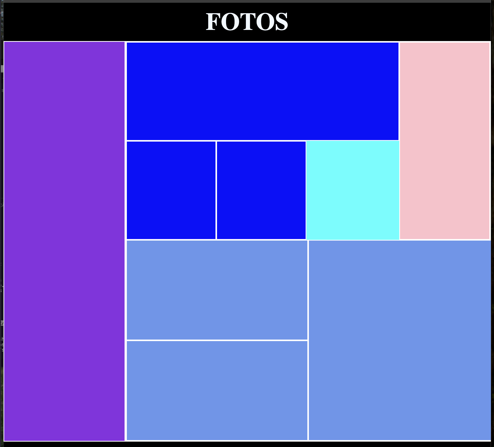

# Galeria-Flex

Primeiro layout de galeria flex, criado com o foco de obter aprendizado criando galeira ou algum layout de algo. Desenvolvido nas aulas de Linguagem de Marcação na escola SENAI Jandira.

## Tecnologias
* HTML
* CSS
* Markdown
* git
* github

## Autor
[João Pedro](https://www.linkedin.com/in/jo%C3%A3o-pedro-a93926234/)